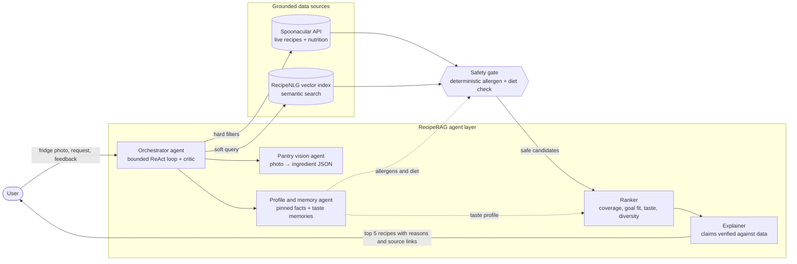
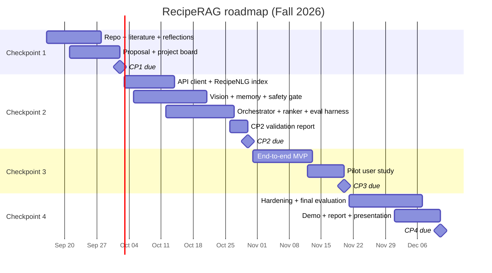

# RecipeRAG: An Agentic AI Personal Chef

**Snap your fridge, state your goals, and get real, allergy-safe recipes ranked for you, grounded in recipe data instead of AI guesswork.**

[Proposal](proposal/PROPOSAL.md) · [Literature](literature/BIBLIOGRAPHY.md) · [Reflections](reflections/) · [Issues](https://github.com/adityad6/recipe-rag/issues) · [Milestones](https://github.com/adityad6/recipe-rag/milestones) · [Project board](https://github.com/adityad6/recipe-rag/projects)

> **Status:** Checkpoint 1 (Foundations & Proposal) · Fall 2026

---

## Team Members & Roles

| Member | Responsibility | Contact |
| --- | --- | --- |
| Chaitanya Nirantar | Problem framing, target users, core tasks, and presentation slides 1–3 | [cn32@illinois.edu] |
| [] | Literature synthesis, bibliography, and competitive analysis | [University email] |
| Aditya Dilip | Technical approach, Checkpoint 2 validation, and risk analysis | [adityad6@illinois.edu] |
| Prathamesh Mulay | Repository organization, project tracking, roadmap, and final submission | [University email] |

Each member will review at least two distinct academic papers, write an individual reflection, and contribute through commits, issues, and pull requests.

---

## Problem Statement & Motivation

"What should I cook tonight?" is a small question with a hard answer. A good answer has to satisfy several constraints at once: what is actually in the kitchen, what the person enjoys, what they must never eat, and what their body needs. Today people solve this by hand, jumping between recipe sites, nutrition apps, and ingredient labels.

**Why it matters**

- **Safety.** An estimated **10.8% of U.S. adults** have a convincing food allergy. Among them, **51.1%** have had a severe reaction and **45.3%** are allergic to more than one food (Gupta et al., 2019). A recipe suggestion that misses one ingredient is not just unhelpful; it can be dangerous.
- **Waste.** The world wasted **1.05 billion tonnes of food in 2022**, almost one-fifth of all food available to consumers, and **60% of that waste happened in households** (UNEP, 2024). Cooking from what is already in the fridge is one of the most direct levers an individual has.
- **Health goals.** Nutrient-based meal recommendations can help people prevent or manage conditions such as diabetes and obesity, but only if the meals also appeal to the person eating them (Yang et al., 2017).

**Why now**

- "Just ask an AI for a recipe" is now mainstream, but chatbots are not safe by default. When ChatGPT built 56 diets for people with food allergies, it was generally accurate but could produce harmful diets, such as a nut-free diet that included almond milk, and its more common errors involved portions and calories (Niszczota & Rybicka, 2023).
- Multimodal LLMs can now read a cluttered fridge photo, tool-calling agents can coordinate external APIs, and text embeddings are cheap. A system that **retrieves** real recipes, **enforces** safety constraints in code, and **remembers** a user's taste is now practical to build and evaluate within a semester.

---

## Target Users & Core Tasks

### Primary personas

| Persona | Context | Pain point | Success looks like |
|---|---|---|---|
| **Maya, the allergy-aware parent** (38) | Cooks dinner for a family of four; their 7-year-old has peanut and egg allergies | Re-reads every ingredient list; doesn't trust generic "allergy filters" | Dinner ideas that are safe for everyone, with the reasoning shown |
| **Jordan, the goal-driven professional** (27) | Strength-trains and targets ~150 g protein/day; has 30 minutes to cook | Macro apps give numbers, not meals worth looking forward to | High-protein meals that fit the macros *and* the palate |
| **Sam, the budget-conscious student** (20) | Shared apartment fridge, irregular groceries, beginner cook | Food spoils; no idea what to make from leftovers | "Here's what you can make right now" from a single photo |

### Core tasks

1. **Snap & cook.** Photograph the fridge or pantry, confirm the detected ingredients with one tap, and get recipes ranked by how much of what's on hand they use.
2. **Ask with constraints.** Make a natural-language request (*"vegetarian, no mushrooms, 35 g+ protein, under 30 minutes"*) and get recipes that satisfy every hard constraint, each with a short, grounded explanation.
3. **Teach it your taste.** Mark recipes as cooked, loved, skipped, or "never again." RecipeRAG remembers, adjusts future rankings, and lets you view, edit, or delete everything it has learned.

---

## Competitive Landscape

| Category | Examples | What they do well | Where they fall short |
|---|---|---|---|
| Recipe search sites | Allrecipes, Food Network | Huge catalogs, ratings, reviews | Search is manual (keywords and filters); results aren't personalized to your pantry or nutrition goals |
| Personalized recipe apps | Yummly | Personalized discovery with diet and allergy preferences | [Shut down in December 2024](https://en.wikipedia.org/wiki/Yummly), leaving a gap in personalized recipe discovery |
| Pantry matchers | [SuperCook](https://www.supercook.com/) | Matches recipes to the ingredients you have; voice entry | You build the pantry by hand or voice; results center on ingredient overlap rather than nutrition goals or taste learned over time |
| Food ecosystems | [Samsung Food](https://www.samsung.com/us/home-appliances/samsung-food/) | Photo-based ingredient logging, meal planning, recipes from your food list | Closed ecosystem; features such as finding recipes from your food list are part of the paid Samsung Food+ tier |
| Meal planners & trackers | Mealime, Eat This Much, MyFitnessPal | Plans and logs around calorie and macro targets; grocery lists | Built for planning and logging ahead of time, not "what can I cook right now with what I have?" |
| General AI chatbots | ChatGPT, Gemini, Claude | Flexible conversation; can read photos and write recipes | Recipes and nutrition numbers are often *generated* rather than retrieved from verified data; allergen compliance isn't guaranteed (Niszczota & Rybicka, 2023); preferences live in free-form chat memory rather than enforceable constraints |
| Research prototypes | Yum-me (Yang et al., 2017), pFoodReQ (Chen et al., 2021), ChatDiet (Yang et al., 2024) | Visual taste elicitation; constraint-aware recommendation over a food knowledge graph; LLM-explained nutrition advice | Each solves one piece; none combines pantry vision, live recipe retrieval, enforced safety constraints, and long-term memory in an end-user tool |

**The gap:** no existing tool treats *the kitchen, the person, and the plate* as a single problem while keeping the LLM honest.

---

## Initial Concept & Value Proposition

RecipeRAG is a multi-agent system in which a large language model **coordinates specialized tools instead of inventing recipes**. The LLM parses requests, plans, and explains; real data sources supply the recipes and numbers; and code, not the model, enforces safety.



| Module | What it does | Grounding in our literature |
|---|---|---|
| **Orchestrator agent** | Parses the request, plans tool calls in a bounded loop, and runs a critic check on results | Interleaved reasoning and tool use (Yao et al., 2023); LLM planner with recommender tools and reflection (Huang et al., 2025) |
| **Pantry vision agent** | Turns a fridge/pantry photo into structured ingredients with confidence scores for the user to confirm | Ingredient-set prediction from images (Salvador et al., 2019); food-specialized multimodal models (Yin et al., 2025) |
| **Profile & memory agent** | Stores allergies and diet as pinned facts; stores feedback as decaying taste memories summarized into editable insights | Memory retrieval by recency, importance, and relevance (Park et al., 2023); like/dislike/expect user profiles (Huang et al., 2025) |
| **Retrieval tools** | Hard constraints become Spoonacular query filters; vague, taste-based requests go to semantic search | Retrieval-augmented generation (Lewis et al., 2020); constraint-aware food recommendation (Chen et al., 2021) |
| **Safety gate** | Checks every candidate's full ingredient list against an allergen derivative lexicon before anything reaches the user | LLM diets can include hidden allergens (Niszczota & Rybicka, 2023) |
| **Ranker** | Scores pantry coverage, nutrition-goal fit, taste similarity, and diversity; then applies LLM reranking with candidate shuffling | LLM rankers show position and popularity bias (Hou et al., 2024); goals filter, taste ranks (Yang et al., 2017) |
| **Explainer** | Writes a short "why this recipe" card whose factual claims are checked against retrieved data | Explanations are an open gap in food recommendation (Trattner & Elsweiler, 2017); LLM explanations can contradict their evidence (Yang et al., 2024) |

### Value proposition

- **Grounded:** every recipe and nutrition number comes from a real data source, never from the model's imagination.
- **Safe by construction:** allergen and diet rules are enforced in code, and uncertain ingredients are flagged instead of silently allowed.
- **Personal:** every cook, skip, and "never again" updates a memory that the user can inspect and edit.
- **Effortless:** one photo and one sentence are enough to get to dinner.

### Data and licensing constraints (by design)

- [Spoonacular's terms](https://spoonacular.com/food-api/terms) allow storing only recipe **IDs, titles, and image URLs** indefinitely, so long-term memory stores only those fields plus the user's own feedback.
- The persistent semantic index is built from [RecipeNLG](https://recipenlg.cs.put.poznan.pl/) (2.2M recipes, licensed for non-commercial research and education).

### Proposed tech stack (finalized at Checkpoint 2)

| Layer | Choice |
|---|---|
| Orchestration | Python + FastAPI; a tool-calling multimodal LLM, with the provider chosen through CP2 benchmarking |
| Recipe data | Spoonacular API (live recipes and nutrition); RecipeNLG (open corpus) |
| Retrieval | Sentence-embedding model + vector store (FAISS or pgvector) |
| Storage | PostgreSQL (SQLite for local development) for profiles, memories, and feedback |
| Frontend | React web app (Streamlit for early prototypes) |
| Evaluation | pytest harness, golden test suites, LLM-as-judge calibrated against human labels, GitHub Actions CI |

---

## Milestones Roadmap

| Checkpoint | Target date | Deliverables |
|---|---|---|
| **CP1: Foundations & Proposal** | Fri, Oct 2, 2026 | Public repo and structure; 12-paper literature corpus and bibliography; individual reflections; formal proposal; issues, milestones, and project board |
| **CP2: Core Agent Logic Validated** | Fri, Oct 30, 2026 | Spoonacular client and RecipeNLG index; profile/memory schema; pantry-vision prompt chain and labeled photo set; orchestrator with tool calling; safety gate; hybrid ranker; evaluation harness and CP2 validation report |
| **CP3: Integrated MVP & Pilot Study** | Fri, Nov 20, 2026 | End-to-end web app (photo → confirmed pantry → ranked, explained recipes); memory view/edit/delete page; pilot usability study (n ≈ 8–10, think-aloud + SUS) |
| **CP4: Final System & Evaluation** | Fri, Dec 11, 2026 | Hardened system; final offline and user evaluation; red-team safety results; demo video; final report and presentation |



Every deliverable above is tracked as a GitHub Issue with an owner, milestone, and due date on the [project board](https://github.com/adityad6/recipe-rag/projects).

---

## Repository Structure

```
recipe-rag/
├── README.md                 # Project landing page (this file)
├── literature/               # Research corpus
│   ├── BIBLIOGRAPHY.md       # Annotated APA bibliography, themes, reviewer assignments
│   ├── references.bib        # BibTeX for all corpus papers
│   └── *.pdf                 # Openly licensed papers only (see BIBLIOGRAPHY.md)
├── reflections/              # One reflection per team member
│   └── lastname_firstname.md
└── proposal/
    └── PROPOSAL.md           # Formal technical proposal
```

## How We Work

- **Issues first.** Every task is a GitHub Issue with an owner, a milestone (checkpoint), labels, and a due date.
- **Branch → PR → review.** Branch per issue (`42-safety-gate`), open a pull request containing `Closes #42`, and get at least one teammate's review before merging into `main`.
- **Individual ownership.** Each member commits their own reflection and code so contributions are visible in the commit and PR history.
- **Weekly rhythm.** Monday planning on the project board, Thursday demo of merged work.

## References

References cited on this page that are outside the literature corpus:

- Gupta, R. S., Warren, C. M., Smith, B. M., Jiang, J., Blumenstock, J. A., Davis, M. M., Schleimer, R. P., & Nadeau, K. C. (2019). Prevalence and severity of food allergies among US adults. *JAMA Network Open, 2*(1), e185630. https://doi.org/10.1001/jamanetworkopen.2018.5630
- United Nations Environment Programme. (2024). *Food Waste Index Report 2024. Think eat save: Tracking progress to halve global food waste*. https://www.unep.org/resources/publication/food-waste-index-report-2024

All other citations (Chen et al., 2021; Hou et al., 2024; Huang et al., 2025; Lewis et al., 2020; Niszczota & Rybicka, 2023; Park et al., 2023; Salvador et al., 2019; Trattner & Elsweiler, 2017; Yang et al., 2017; Yang et al., 2024; Yao et al., 2023; Yin et al., 2025) are listed in full in [`literature/BIBLIOGRAPHY.md`](literature/BIBLIOGRAPHY.md).
